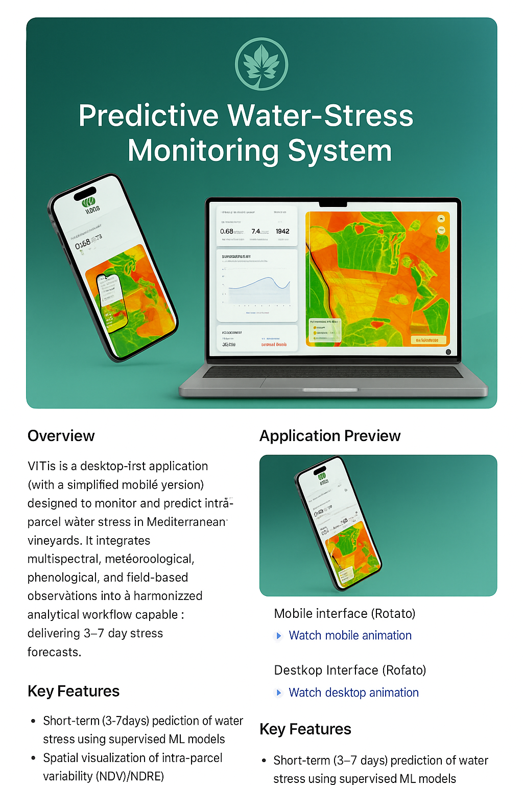

<p align="center">
  
</p>

# VITIs: Predictive Water-Stress Monitoring for Mediterranean Vineyards 🍇💧

VITIs is a cutting-edge project designed to predict water stress in Mediterranean vineyards. By integrating multisource environmental data, applying advanced machine learning techniques, and providing intuitive visualizations, VITIs empowers vineyard managers to make informed decisions about irrigation and resource allocation. This project aims to improve vineyard sustainability, optimize water usage, and enhance crop yields.

<p align="center">
  
</p>

## 🚀 Key Features

- **Water-Stress Prediction:** Utilizes supervised ML models to predict water stress levels based on environmental data.
- **Spatial Visualization:** Provides spatial maps of predicted water stress, allowing for targeted intervention.
- **Atmospheric Data Integration:** Incorporates data from Sentinel-2 imagery, ERA5 meteorological data, and local weather stations.
- **Phenological Alignment:** Aligns data with grapevine phenology using BBCH stages for accurate predictions.
- **Interactive Dashboard:** Offers a user-friendly interface for exploring data and model outputs.
- **Ground-Truth Annotation:** Enables users to annotate data with field scouting observations to improve model accuracy.
- **Mobile and Desktop Interfaces:** Accessible on both mobile and desktop platforms for convenient monitoring.

## 🛠️ Tech Stack

- **Frontend:**
    - *Technology not specified in provided files, but likely uses a framework like React, Angular, or Vue.js*
- **Backend:**
    - *Technology not specified in provided files, but likely uses Python (Flask or Django), Node.js, or similar.*
- **Data Sources:**
    - Sentinel-2 imagery
    - ERA5 meteorological data
    - Meteorological stations
    - Field scouting data
    - Soil and topography data
- **Machine Learning:**
    - Supervised ML models (e.g., scikit-learn, TensorFlow, PyTorch)
- **Data Processing:**
    - Python (with libraries like pandas, numpy, rasterio, GDAL)
- **Other:**
    - BBCH stages (phenological scale)

## 📦 Getting Started

### Prerequisites

- Python 3.7+
- pip package manager

### Installation

```bash
git clone <repository_url>
cd <repository_directory>
pip install -r requirements.txt
```

Populate `requirements.txt` with dependencies such as:

```
numpy
pandas
scikit-learn
rasterio
geopandas
```

### Running Locally

```bash
python main.py
```

or

```bash
flask run
```

## 💻 Usage

The VITIs application provides a user-friendly interface for monitoring water stress in vineyards.

1. **Access the Dashboard:** Open the application in your browser or mobile device.
2. **Explore Spatial Maps:** Visualize predicted water stress levels.
3. **Analyze Data:** Explore atmospheric drivers, vegetation indices, and trends.
4. **Annotate Data:** Add field observations to refine predictions.
5. **Make Decisions:** Apply insights from predictions to improve irrigation strategies.

## 📂 Project Structure

```
VITIs/
├── README.md
├── requirements.txt
├── app/
│   ├── assets/
│   ├── desktop/
│   ├── mobile/
├── models/
├── data/
├── documentation/
└── ...
```

## 📸 Screenshots

(Add static screenshots here if desired.)

## 🤝 Contributing

1. Fork the repository  
2. Create a new branch  
3. Commit changes  
4. Submit a pull request  

## 📝 License

Specify license (e.g., MIT License)

## 📬 Contact

Fernanda Chácara  
Instituto Superior de Agronomia — Lisboa, Portugal  

## 💖 Thanks

Thank you for your interest in the VITIs project! We hope this documentation helps you understand and utilize the system effectively.


