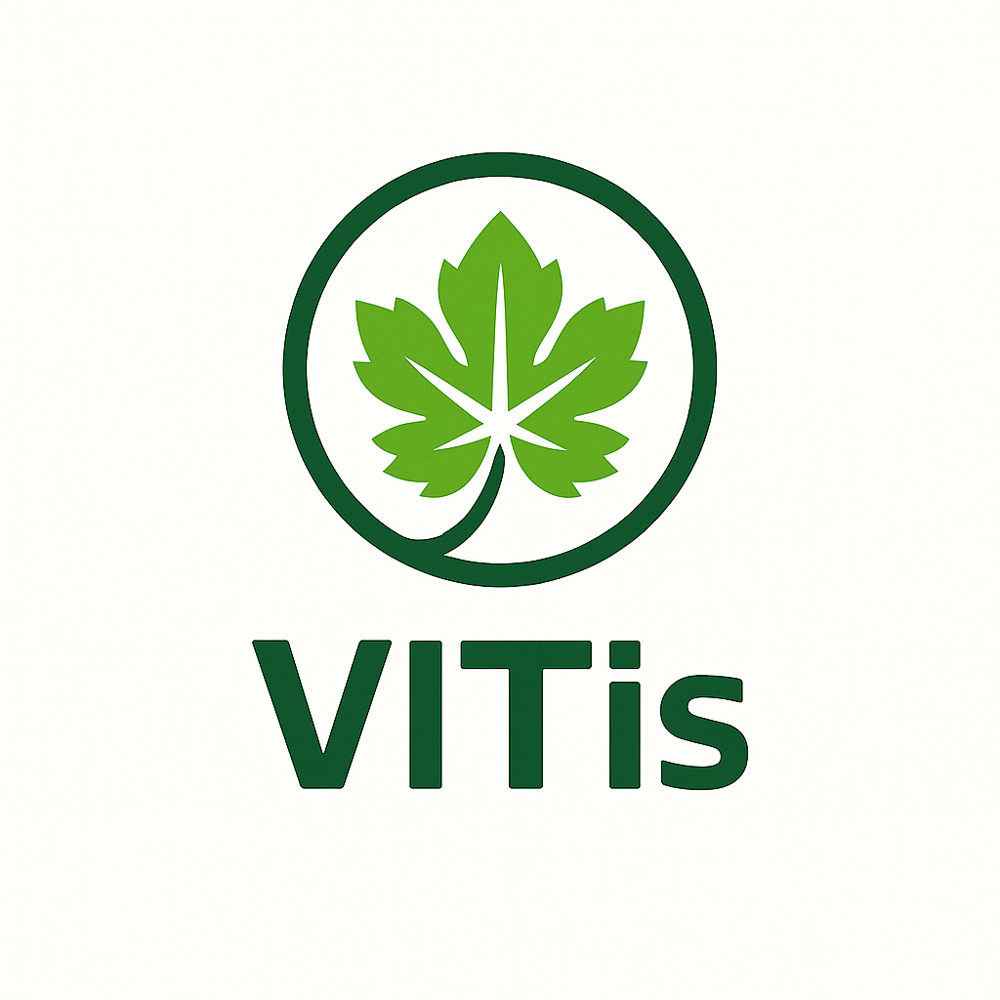
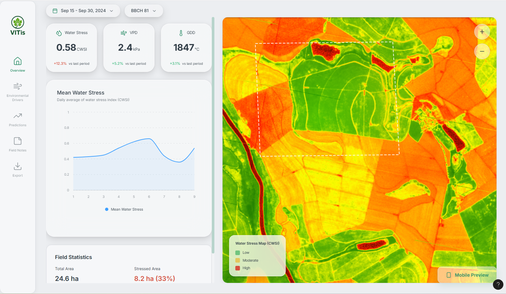
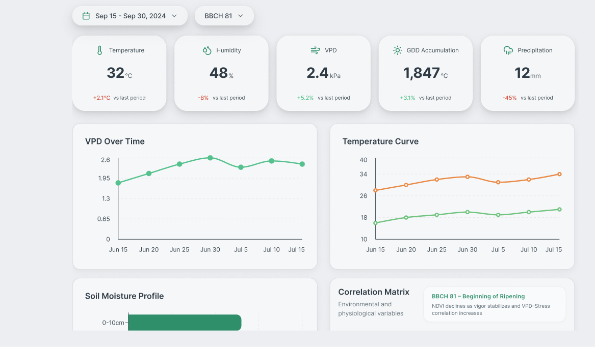
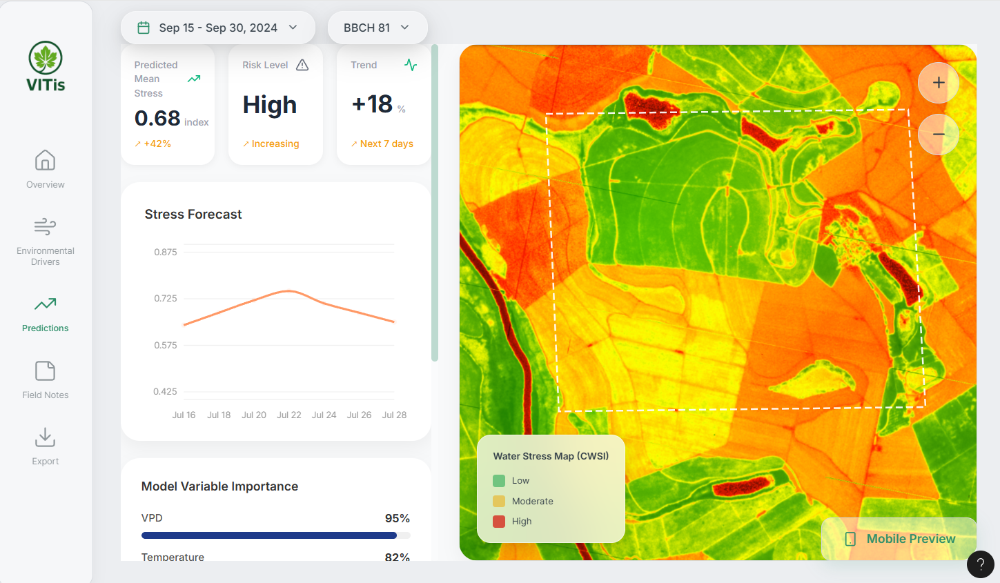
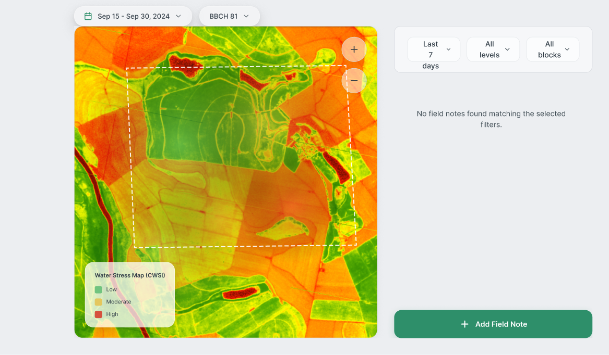
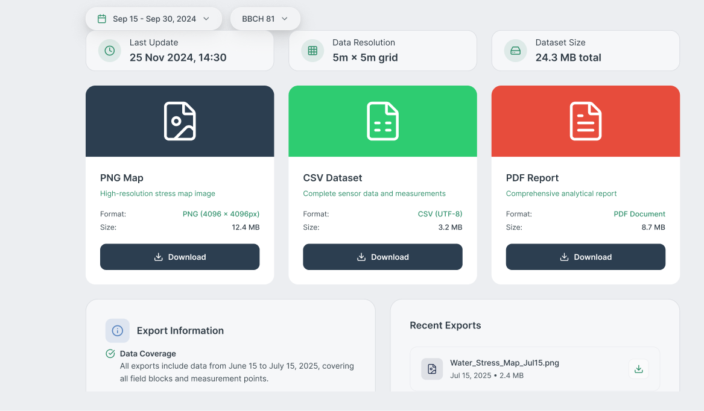

<p align="center">
  
</p>

<h1 align="center">VITIs — Precision Water-Stress Intelligence for Mediterranean Vineyards</h1>

<p align="center">
A predictive application for monitoring and forecasting vineyard water stress with spatial clarity and scientific precision.
</p>

<p align="center">
  
  
  
</p>

<p align="center">
  
</p>

---

## Problem Context

<p align="justify">
Water availability is one of the most limiting factors in Mediterranean viticulture. Rising temperatures, longer dry periods and increasing climatic variability intensify evaporative demand and disrupt the balance between vine physiology and available soil moisture. These conditions amplify spatial differences in stress expression and make early detection more difficult. Traditional assessment methods rely on delayed visual symptoms or fragmented data sources that do not capture the formation or progression of stress in time.
</p>

<p align="justify">
This application addresses these constraints by integrating environmental, spectral and phenological information into a single predictive framework. It provides a clear view of how water stress emerges within each parcel, reveals the factors that drive its evolution and anticipates short term shifts that influence irrigation needs. This supports decisions that protect vine performance, improve resource efficiency and strengthen the resilience of vineyards in a climate that is becoming increasingly demanding.
</p>

---

## Core Capabilities

<h4>Predictive Water Stress Modelling</h4>
<p align="justify">
The application estimates parcel level water stress using environmental, spectral and agronomic variables. This predictive layer supports more informed irrigation decisions and helps identify stress conditions before visible symptoms appear.
</p>

<h4>Spatial Intelligence and Mapping</h4>
<p align="justify">
The system reveals spatial variability within vineyard parcels, allowing the user to detect zones with distinct stress levels and manage irrigation with greater precision and efficiency.
</p>

<h4>Multisource Environmental Integration</h4>
<p align="justify">
The platform combines Sentinel 2 imagery, ERA5 climate data, soil and topographic information and field observations. This integration provides a coherent understanding of how environmental conditions influence water stress across space and time.
</p>

<h4>Phenology Aware Predictions</h4>
<p align="justify">
Predictions adapt to the developmental stage of the vine. This context improves accuracy by recognising that the impact of water stress depends on phenological timing and physiological sensitivity.
</p>

<h4>Designed for Field and Office</h4>
<p align="justify">
The interface is available in both desktop and mobile formats, supporting detailed analysis in the office as well as practical consultation during fieldwork.
</p>

<h4>Ground Truth Annotation</h4>
<p align="justify">
Users can record field observations to refine model interpretation and reinforce the connection between predicted stress and real conditions observed in the vineyard.
</p>

---

## Tech Architecture Overview

Core technologies include Python, pandas, numpy, scikit-learn, geopandas, rasterio and GDAL.

**The system integrates:**  
• Sentinel-2 multispectral imagery  
• ERA5 atmospheric reanalysis  
• Local weather-station variables  
• Soil and topography layers  
• Phenological monitoring (BBCH)

---

## Installation

To install the application, follow the steps below.

### 1. Clone the repository
```bash
git clone https://github.com/FernandaChacara/VITIs.git
```
### 2. Navigate to the project directory
```bash
cd VITIs
```

### 3. Install the required dependencies
Make sure Python is installed on your system. Then install all required libraries.
```bash
pip install -r requirements.txt
```

## ▶️ Running the Application

You can run the application using different execution modes depending on your setup.

### Option 1: Run the Python script
```bash
python main.py
```

### Option 2: Start the Flask server
```bash
flask run
```

### Option 3: Open the Streamlit interface
```bash
streamlit run app.py
```

## Usage

1. Launch the application.  
2. Upload or connect vineyard datasets including imagery, climate data and metadata.  
3. Explore spatial predictions in the Dashboard.  
4. Inspect environmental drivers such as VPD, GDD, NDVI and rainfall.  
5. View short term water stress forecasts.  
6. Add field observations to refine interpretation.
   
---

## Data Requirements

**Required:**  
• Sentinel-2 Level-2A imagery  
• ERA5-Land or station-based atmospheric variables  
• Phenological records (BBCH)  
• Parcel boundaries (Shapefile or GeoJSON)

**Recommended:**  
• Soil texture and depth  
• Canopy vigor or height data  
• Ground-truth stress measurements

Best performance occurs when temporal alignment is preserved across imagery, climate data and phenology.

---

## Project Structure

**VITIs/**
- **app/**
- **data_use_scripts/**
- **database_dump/**
- **documentation/**
- **models/**
- **notebooks/**
- **original_data/**
- **output_graphs/**
- **processed_data/**
- **sql_scripts/**
- **src/**
- .gitignore
- README.md
- requirements.txt


---

## UI Previews

<p align="center">
  
</p>

<p align="center">
  
</p>

<p align="center">
  
</p>

<p align="center">
  
</p>

<p align="center">
  
</p>

---

## Contributing

Contributions are welcome and appreciated.  
To maintain clarity and consistency, please follow the guidelines below.

### How to contribute
1. Fork the repository to your GitHub account.  
2. Create a dedicated branch for your contribution.  
3. Commit changes with clear and informative messages.  
4. Submit a pull request for review.

### Contribution principles
• Ensure that your work is aligned with the project’s direction.  
• Maintain clean and readable code.  
• Include documentation updates when relevant.  
• Provide context for any significant change.

### Review process
Pull requests are reviewed to ensure correctness, coherence and compatibility with the existing architecture.  
Approved contributions are merged into the main branch.

Thank you for supporting the development of this application.
---

## Contact

<p align="center">
Fernanda Chácara<br>
Dandara França<br>
Catarina Silva<br>
Instituto Superior de Agronomia — Lisbon, Portugal
</p>

---

<p align="center">
<strong>Empowering smarter irrigation decisions through spatial, predictive insight.</strong>
</p>


