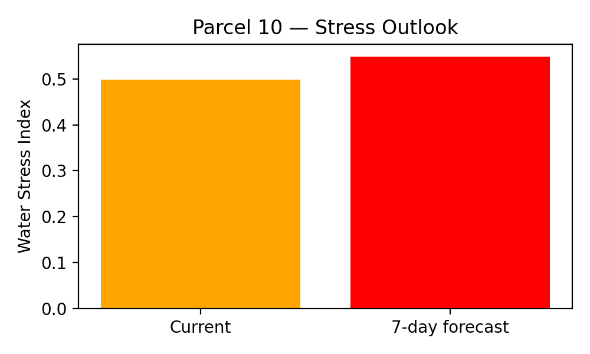

# VITIS — Decision Support Alert

## Vineyard Parcel Assessment

**Parcel ID:** 10  
**Parcel Name:** Herdade dos Ventos

---

## 1. Vegetative Condition
- **Mean NDVI:** 0.243

---

## 2. Water Stress Assessment
- **Current Water Stress Index:** 0.499
- **7-day Forecast Water Stress Index:** 0.549
- **Stress Classification:** medium

---

## 3. Decision Support Recommendation
**MONITOR CONDITIONS**

---

## 4. Model Confidence
- **Decision confidence score:** 1.00

---

## 5. Stress Outlook Visualization

---

*Automatically generated by the VITIS Decision Support System.*
