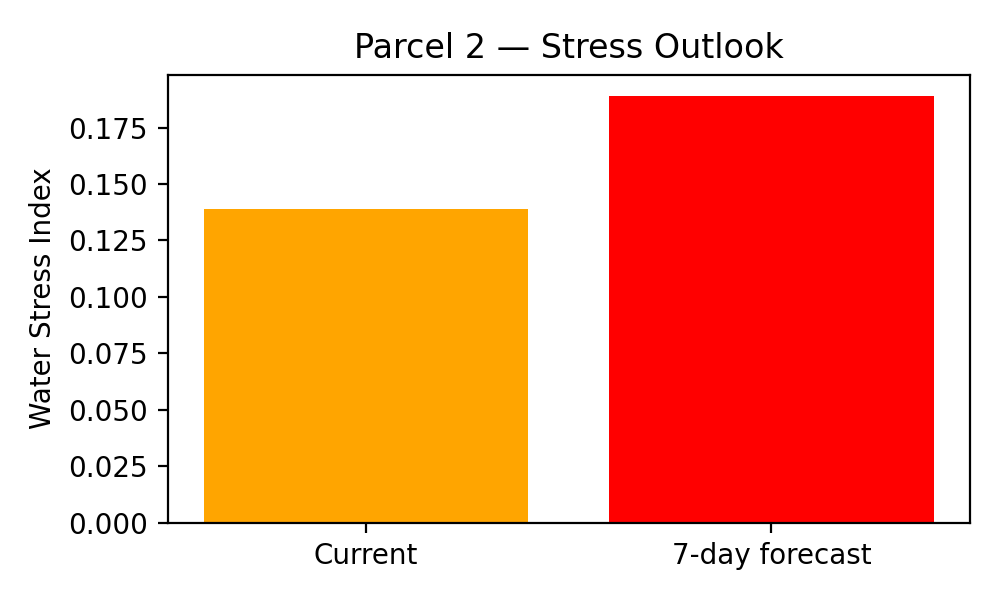

# VITIS — Decision Support Alert

## Vineyard Parcel Assessment

**Parcel ID:** 2  
**Parcel Name:** Quinta dos Barreiros

---

## 1. Vegetative Condition
- **Mean NDVI:** 0.634

---

## 2. Water Stress Assessment
- **Current Water Stress Index:** 0.139
- **7-day Forecast Water Stress Index:** 0.189
- **Stress Classification:** low

---

## 3. Decision Support Recommendation
**No irrigation required. Continue monitoring.**

---

## 4. Model Confidence
- **Decision confidence score:** 0.85

---

## 5. Stress Outlook Visualization

---

*Automatically generated by the VITIS Decision Support System.*
